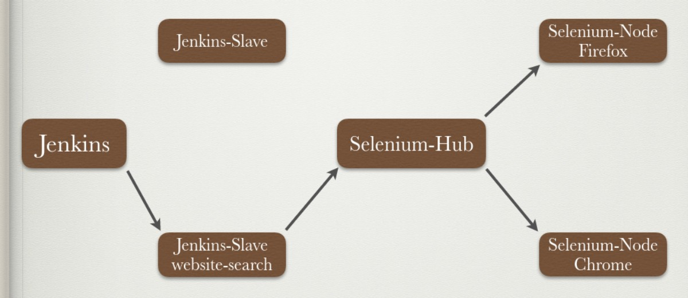

# website-search
  Project website-search is a automation test of robot framework. It tests searching official website on Chrome and Firefox as well as captures screenshots.

- - -

## Prerequisites
  * Please install **_[Docker-Engine](https://docs.docker.com/engine/installation/linux/ubuntulinux/)_** and **_[Docker-Compose](https://docs.docker.com/compose/install/)_** first.

## Install
  * Please download the code:
    ```
    $ git clone https://github.com/demontsai/website-search.git
    ```

  * Run command:
    ```
    $ docker-compose up -d
    ```

## Usage
### Build
  * When you complete command, please open [Jenkins](http://localhost:8080).
  * You would see login page, account/password is **ruckus/ruckus**.
  * There is a project called `website-search` at home page.
  * Entering `website-search` project and build it.
  * You could click `#BUILD_NUMBER` and see what's going on in `Console Output` if you want to.
  * Use [VNC](https://chrome.google.com/webstore/detail/vnc%C2%AE-viewer-for-google-ch/iabmpiboiopbgfabjmgeedhcmjenhbla?utm_source=chrome-ntp-icon), you can connect into selenium-node and see browser behavior, for chrome: `localhost:5900`, for firefox: `localhost:5901`
  * More details at [test case](test_case/website-search.robot)

### Result
  * In `#BUILD_NUMBER` page, you would see result including `report.html` and `log.html`.
  * There are two screentshots, `website_screenshot_Chrome.png`	and `website_screenshot_Firefox.png`, their location is at `$BUILD_NUMBER -> Browse results -> Original result files`.
  * Screenshots would show you Ruckus Wireless official website.

### Optional
  * If you want to search other official website.
    1. Entering `project website-search -> Configure -> Build section`.
    2. Modify command `robot -d build test_case/website-search.robot` to `robot -d build --variable KEYWORD:your_keyword --variable OFFICIAL_WEBSITE:website_url test_case/website-search.robot`
      * Example: `robot -d build --variable --variable KEYWORD:touchcloud --variable OFFICIAL_WEBSITE:www.touchcloud.com.tw/ test_case/website-search.robot`
    3. Save and build it again.
    4. Screenshot would show you official website what you want.

## Architecture
  
  * Docker image `jenkins-slave:base` and `jenkins-slave:website-search` already done and push to my [DockerHub](https://hub.docker.com/r/demontsai/jenkins-slave/) for speedup.
  * `jenkins-slave:base` image is a jenkins-slave with clean environment (only openjdk installed).
  * `jenkins-slave:website-search` image base on `jenkins-slave:base` with python-pip, git, robotframework and robotframework-selenium2library for test environment.
  * More Dockerfile details at [jenkins-slave:base](/Dockerfile/jnkslv/Dockerfile) and [jenkins-slave:website-search](/Dockerfile/jnkslv_website-search/Dockerfile)
